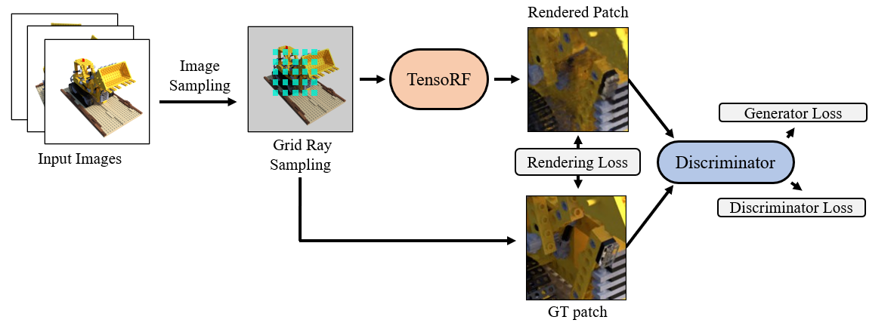

# DiscoRF: Discriminator on TensoRF

### Byeongwoo Jeon, Seoyeon Byeon, Suhyeok Kim, Seonghu Jeon, Hoongyu Chung

This repository contains a pytorch implementation for the Korea University DATA302 Project, "DiscoRF: Discriminator on TensoRF". All of the settings below follow the original paper, [TensoRF](https://apchenstu.github.io/TensoRF/).

## Installation

#### Tested on Ubuntu 20.04 + Pytorch 1.10.1 

Install environment:
```
conda create -n TensoRF python=3.8
conda activate TensoRF
pip install torch torchvision
pip install tqdm scikit-image opencv-python configargparse lpips imageio-ffmpeg kornia lpips tensorboard
```


## Dataset
* [Synthetic-NeRF](https://drive.google.com/drive/folders/128yBriW1IG_3NJ5Rp7APSTZsJqdJdfc1) 
* [Synthetic-NSVF](https://dl.fbaipublicfiles.com/nsvf/dataset/Synthetic_NSVF.zip)
* [Tanks&Temples](https://dl.fbaipublicfiles.com/nsvf/dataset/TanksAndTemple.zip)
* [Forward-facing](https://drive.google.com/drive/folders/128yBriW1IG_3NJ5Rp7APSTZsJqdJdfc1)


## Quick Start
The training script is in `train.py` or `train_withGAN.py`, to train a TensoRF:

```
python train.py --config configs/lego.txt
```

or,

```
python train_withGAN.py --config configs/lego.txt
```


we provide a few examples in the configuration folder, please note:

 `dataset_name`, choices = ['blender', 'llff', 'nsvf', 'tankstemple'];

 `shadingMode`, choices = ['MLP_Fea', 'SH'];

 `model_name`, choices = ['TensorVMSplit', 'TensorCP'], corresponding to the VM and CP decomposition. 
 You need to uncomment the last a few rows of the configuration file if you want to training with the TensorCP model；

 `n_lamb_sigma` and `n_lamb_sh` are string type refer to the basis number of density and appearance along XYZ
dimension;

 `N_voxel_init` and `N_voxel_final` control the resolution of matrix and vector;

 `N_vis` and `vis_every` control the visualization during training;

  You need to set `--render_test 1`/`--render_path 1` if you want to render testing views or path after training. 

More options refer to the `opt.py`. 

### For pretrained checkpoints and results please see:
[https://1drv.ms/u/s!Ard0t_p4QWIMgQ2qSEAs7MUk8hVw?e=dc6hBm](https://1drv.ms/u/s!Ard0t_p4QWIMgQ2qSEAs7MUk8hVw?e=dc6hBm)


## Rendering

```
python train.py --config configs/lego.txt --ckpt path/to/your/checkpoint --render_only 1 --render_test 1 
```

You can just simply pass `--render_only 1` and `--ckpt path/to/your/checkpoint` to render images from a pre-trained
checkpoint. You may also need to specify what you want to render, like `--render_test 1`, `--render_train 1` or `--render_path 1`.
The rendering results are located in your checkpoint folder. 

## Extracting mesh
You can also export the mesh by passing `--export_mesh 1`:
```
python train.py --config configs/lego.txt --ckpt path/to/your/checkpoint --export_mesh 1
```
Note: Please re-train the model and don't use the pretrained checkpoints provided by us for mesh extraction, 
because some render parameters has changed.

## Training with your own data
We provide two options for training on your own image set:

1. Following the instructions in the [NSVF repo](https://github.com/facebookresearch/NSVF#prepare-your-own-dataset), then set the dataset_name to 'tankstemple'.
2. Calibrating images with the script from [NGP](https://github.com/NVlabs/instant-ngp/blob/master/docs/nerf_dataset_tips.md):
`python dataLoader/colmap2nerf.py --colmap_matcher exhaustive --run_colmap`, then adjust the datadir in `configs/your_own_data.txt`. Please check the `scene_bbox` and `near_far` if you get abnormal results.
    
